# 软件工程实训任务一：代码规范与标注

## 1.样例工程的代码结构分析
### 1.1原始版本代码的类图
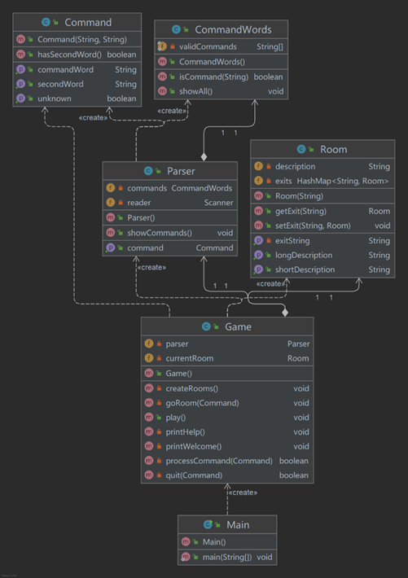

### 1.2原始版本项目描述
1.其中Main类中有主函数，是项目的入口。

2.CommandWords类中的validCommands 数组存储了项目中所有的命令，并提供了判断一个字符串是否是有效命令的方法isCommand，以及打印所有命令的方法showAll。

3.Command类为项目中的命令类，其有两个成员变量，第一个成员变量CommandWord用于保存命令关键字，第二个成员变量用于保存命令后所跟的选项。

4.Parser类负责将用户输入的命令转化为Command对象。

5.Room类是该项目中表示场景时使用的类，其有两个成员变量，description用于保存该场景的描述信息，HashMap用于保存与该场景相邻的场景信息，key是direction，value是Room对象。

6.Game类是游戏的核心类，其中的parser用于读取用户输入的命令，currentRoom用于保存当前的场景信息，createRoom方法用于初始化游戏的场景信息，printWelcome方法的作用是打印一些欢迎提示信息，processCommand方法会判断具体是哪个命令然后调用相应的处理逻辑。printHelp，goRoom，quit方法分别用于处理help命令，go命令和quit命令。

## 2.标注样例工程中的代码
### 2.1添加javadoc注释
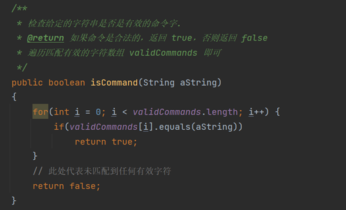

### 2.2推送远程仓库
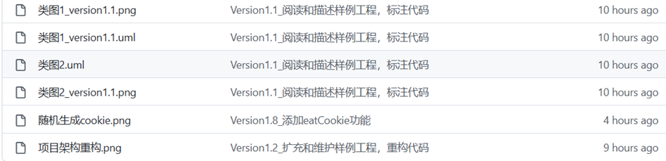

## 3.扩充和维护样例工程
### 3.1修改processCommand
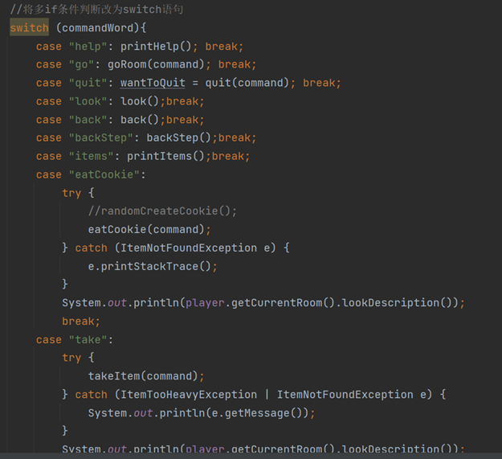

### 3.2重构代码
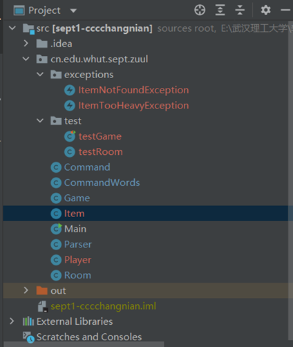

## 4.功能扩充

1. 添加并实现look命令。
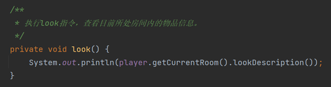
2. 添加并实现back命令。
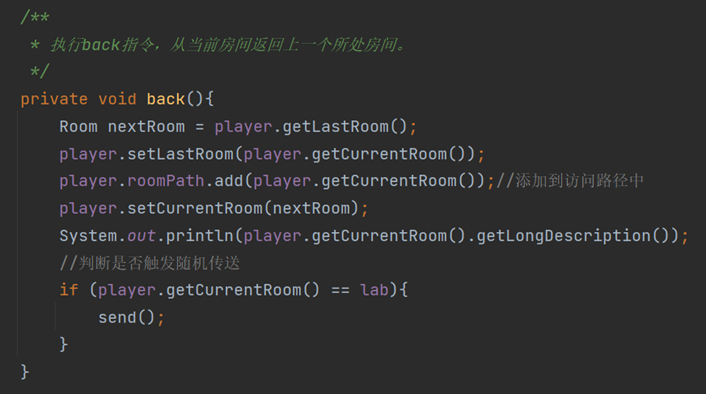
3. 添加并实现take命令。
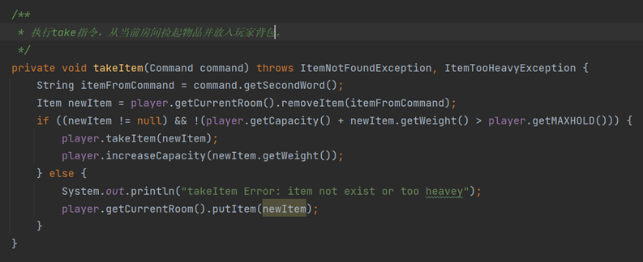
4. 添加并实现drop命令。
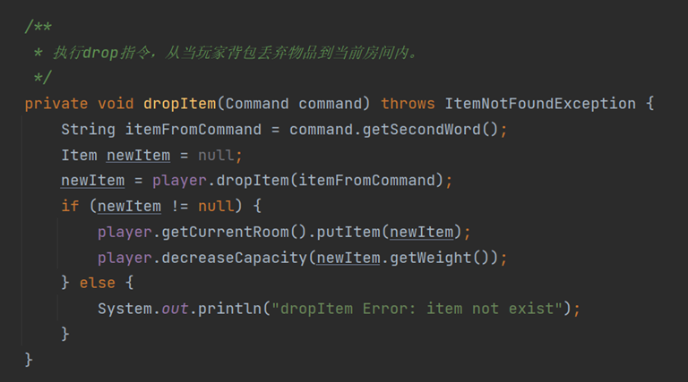
5. 添加并实现items命令。
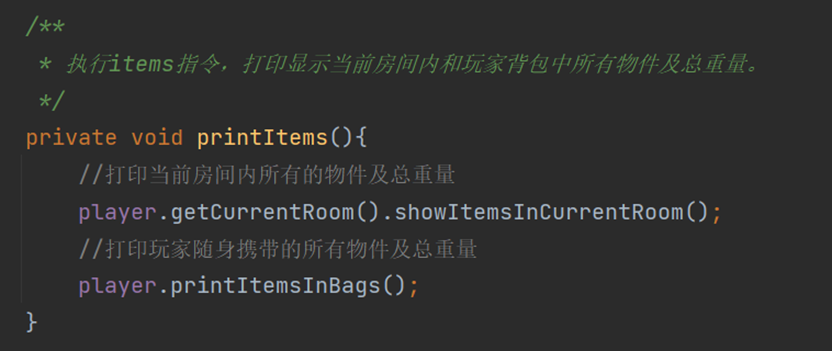
6. 添加并实现eatCookie命令。
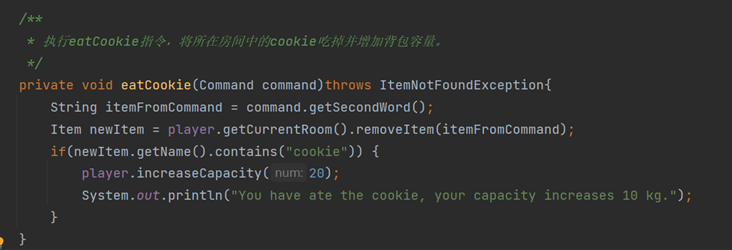
7. 添加并实现房间随机传送功能。
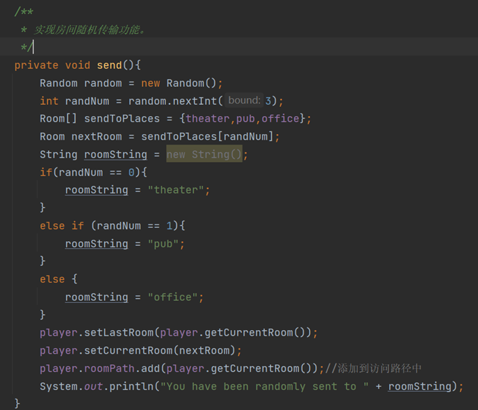
8. 添加并实现高级back功能。
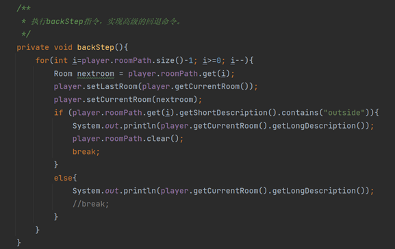

## 5.编写测试类
### 编写testGame类。
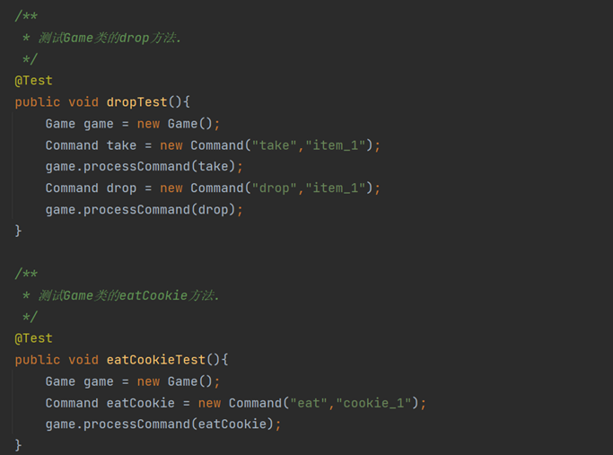
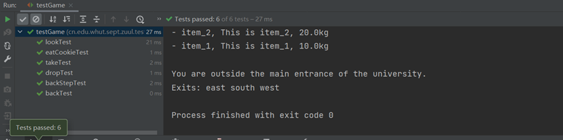

### 编写testRoom类。
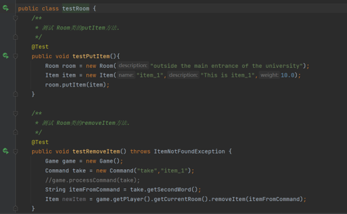
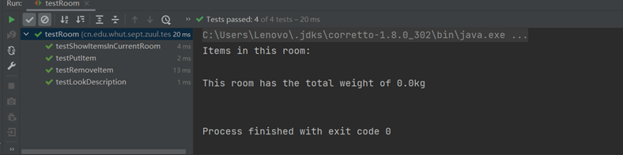